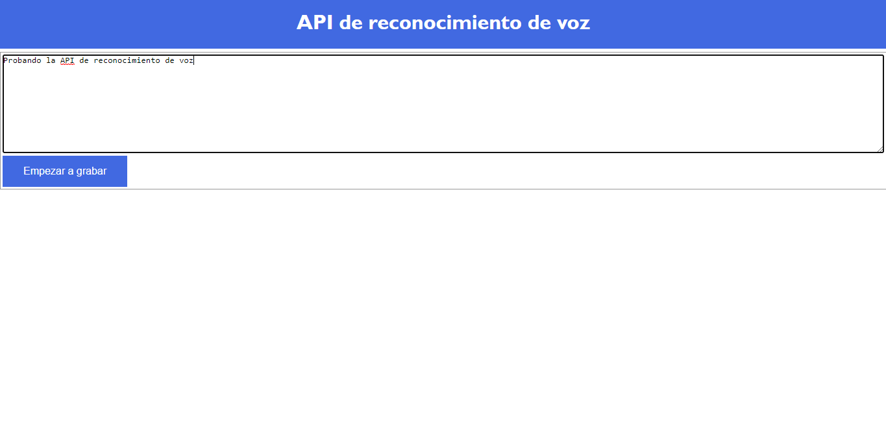

# Browser Speech to Text

A small browser demo that **transcribes speech into text** using `webkitSpeechRecognition`. It includes microphone controls, interim results, and a final transcript. The recognition language is configured as Mexican Spanish (`es-MX`).



## Run locally

Use a browser that implements `webkitSpeechRecognition` and allow microphone access when prompted. There is no package installation or build step.

Serve the repository with a local HTTP server. For example, with Python 3 installed:

```sh
python -m http.server 8000 --bind 127.0.0.1
```

Open **http://127.0.0.1:8000/**, click the recording control, speak, and stop recording to see the final text. The page's existing controls remain in Spanish.

## Files

- [index.html](index.html): page markup and controls.
- [index.js](index.js): recognition lifecycle and transcript handling.
- [styles.css](styles.css): page styling.

## Compatibility and validation

The code uses a browser-prefixed API, so support is browser-dependent. The browser's recognition service may require internet access. If recording does not start, check API support, microphone permissions, and the browser console.

The repository does not contain automated tests. Verify starting, stopping, interim text, and final text manually. This project performs speech recognition; it does not synthesize speech from text.
